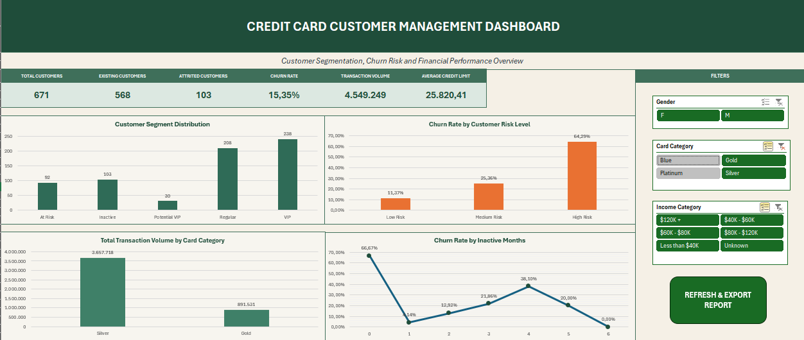

# Credit Card Customer Segmentation

Credit card customer segmentation, churn analysis, and interactive reporting with Excel, Power Query, PivotTables, scenario analysis, Solver, and VBA.



## Project Overview

This project analyzes **10,127 credit card customers** to identify customer segments, churn patterns, financial behavior, and retention opportunities.

The main objectives are to:

- clean and standardize customer data,
- create behavior-based customer segments,
- analyze churn drivers,
- build an interactive management dashboard,
- evaluate retention scenarios,
- optimize campaign budget allocation,
- convert analytical findings into actionable business recommendations.

## Dataset

The dataset contains demographic, financial, behavioral, and customer relationship information.

### Main fields

- `CLIENTNUM`
- `Attrition_Flag`
- `Customer_Age`
- `Gender`
- `Dependent_count`
- `Education_Level`
- `Marital_Status`
- `Income_Category`
- `Card_Category`
- `Months_on_book`
- `Total_Relationship_Count`
- `Months_Inactive_12_mon`
- `Contacts_Count_12_mon`
- `Credit_Limit`
- `Total_Revolving_Bal`
- `Avg_Open_To_Buy`
- `Total_Trans_Amt`
- `Total_Trans_Ct`
- `Avg_Utilization_Ratio`

## Data Quality Issues

The original dataset included realistic data quality problems:

- missing income categories,
- inconsistent education labels,
- invalid customer ages,
- missing credit limits,
- negative credit limits,
- incorrect decimal interpretation caused by locale settings,
- inconsistent data types.

## Data Cleaning Process

Data cleaning and transformation were completed in **Power Query**.

### Applied operations

- Replaced **1,112 missing income values** with `Unknown`.
- Standardized **47 inconsistent education labels**.
- Replaced **25 invalid age values** with the median age of `46`.
- Recalculated **300 missing** and **10 negative credit limits** using:

```text
Credit_Limit = Avg_Open_To_Buy + Total_Revolving_Bal
```

- Corrected decimal fields using the `English (United States)` locale.
- Assigned appropriate data types.
- Verified that all `CLIENTNUM` values were unique.
- Confirmed that the cleaned dataset contained no missing values in the modeled fields.

A detailed cleaning report is available here:

- [Data Cleaning Report](reports/Kredi_Karti_Musterileri_Veri_Temizleme_Raporu_Sade.pdf)

## Feature Engineering

The following analytical fields were created:

| Field | Description |
|---|---|
| `Age_Group` | Groups customers into `25-35`, `36-45`, `46-55`, and `56+` |
| `Average_Transaction_Value` | Average value per transaction |
| `Monthly_Average_Spending` | Estimated monthly spending |
| `Utilization_Level` | Low, Medium, or High credit utilization |
| `Churn_Flag` | Binary churn indicator |
| `Customer_Segment` | Customer behavior segment |
| `Risk_Score` | Behavioral risk score |
| `Risk_Level` | Low, Medium, or High risk |

## Customer Segmentation

Customers were divided into five behavioral segments:

- **VIP**
- **Potential VIP**
- **Regular**
- **At Risk**
- **Inactive**

The segmentation model uses:

- customer status,
- transaction amount,
- transaction count,
- inactivity,
- behavioral thresholds.

### Segment distribution

| Segment | Customer Count |
|---|---:|
| Regular | 3,830 |
| At Risk | 1,971 |
| Inactive | 1,627 |
| VIP | 1,562 |
| Potential VIP | 1,137 |

## Descriptive Statistics

The project includes average, median, minimum, and maximum statistics for:

- customer age,
- credit limit,
- revolving balance,
- available credit,
- transaction amount,
- transaction count,
- customer relationship duration,
- utilization ratio.

### Main KPIs

| KPI | Value |
|---|---:|
| Total Customers | 10,127 |
| Existing Customers | 8,500 |
| Attrited Customers | 1,627 |
| Churn Rate | 16.07% |
| Total Transaction Volume | 44,600,182 |
| Average Credit Limit | 8,631.95 |

## Pivot Analysis

More than ten PivotTable analyses were created, including:

1. Customer Segment Distribution
2. Customer Status Distribution
3. Customer Distribution by Age Group and Gender
4. Average Credit Limit by Income Category
5. Total Transaction Volume by Card Category
6. Average Annual Spending by Customer Segment
7. Average Transaction Count by Customer Segment
8. Churn Rate by Inactive Months
9. Churn Rate by Relationship Count
10. Churn Rate by Contact Count
11. Churn Rate by Customer Risk Level

## Scenario Analysis

### Goal Seek

Goal Seek was used to estimate how many customers must be retained to reduce churn.

- Current churn rate: **16.07%**
- Target churn rate: **12.00%**
- Required customers to retain: **at least 412**

### Two-Variable Data Table

A two-variable Data Table evaluates the impact of:

- campaign success rate,
- campaign cost per customer,

on the campaign's net financial impact.

### Solver Optimization

Solver was used to maximize net financial impact under a fixed campaign budget.

- Available campaign budget: **300,000**
- Customers targeted: **1,957**
- Expected retained customers: **approximately 496**
- Net financial impact: **215,120**

## Interactive Management Dashboard

The Excel dashboard includes:

- six dynamic KPI cards,
- four management charts,
- slicers for:
  - gender,
  - card category,
  - income category,
- synchronized PivotTables and charts,
- dynamic KPI updates,
- one-page PDF output.

Dashboard preview:


## Strategic Recommendations

The analysis resulted in six main business recommendations:

1. Build an early-warning system for High Risk and Medium Risk customers.
2. Trigger proactive retention actions for inactive and frequently contacting customers.
3. Apply segment-specific campaigns for At Risk, Inactive, and Potential VIP customers.
4. Set an annual retention target of at least 412 customers.
5. Evaluate campaign profitability before implementation.
6. Allocate campaign budgets according to expected return instead of equal distribution.

An implementation roadmap defines:

- action,
- timeframe,
- responsible unit,
- target KPI,
- target value,
- priority.

## Automated Reporting

The workbook includes a VBA macro named:

```text
RefreshAndExportReport
```

The macro:

- refreshes Power Query connections,
- refreshes PivotTables,
- recalculates formulas,
- saves the workbook,
- exports the management dashboard as a timestamped PDF.

## Repository Structure

```text
credit-card-customer-segmentation/
│
├── README.md
├── LICENSE
├── .gitignore
│
├── data/
│   ├── raw/
│   │   └── credit_card_customers_raw.csv
│   └── processed/
│       └── credit_card_customers_clean.csv
│
├── excel/
│   └── Credit_Card_Customer_Analysis.xlsm
│
├── reports/
│   ├── Data_Cleaning_Report_TR.pdf
│   └── Management_Dashboard.pdf
│
├── screenshots/
│   ├── management_dashboard.png
│   ├── scenario_analysis.png
│   ├── pivot_analysis.png
│   └── strategic_recommendations.png
```

## Tools and Technologies

- Microsoft Excel
- Power Query
- PivotTables and PivotCharts
- Excel formulas
- Goal Seek
- What-If Analysis
- Two-Variable Data Table
- Solver
- Slicers
- VBA
- PDF reporting

## How to Use

1. Download the repository.
2. Open:

```text
excel/Credit_Card_Customer_Analysis.xlsm
```

3. Enable macros when Excel displays a security warning.
4. Open the management dashboard.
5. Use the slicers to filter customer groups.
6. Click `REFRESH & EXPORT REPORT` to refresh the analysis and create a PDF report.

## Data Limitations

- The dataset does not include city information, so city-based analysis could not be performed.
- All records belong to credit card customers, so non-cardholder acquisition analysis is outside the dataset scope.
- Campaign cost, success rate, and retained customer value used in scenario analysis are management assumptions created for analytical modeling.

## Author

**Sevgi Nur Öksüz**

Computer Engineering
Data Analysis Project — Week 1-2
